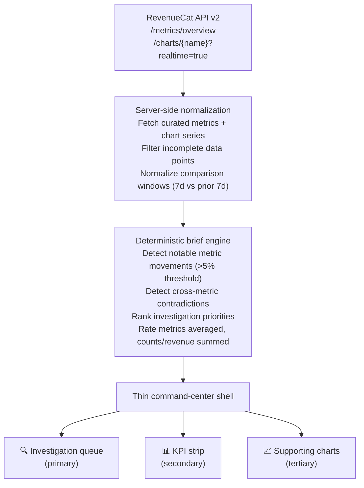

# I built a brief-first monetization operator on top of RevenueCat's Charts API

RevenueCat's Charts API gives developers and operators access to the metrics that actually matter in a subscription business: revenue, MRR, churn, trial conversion, retention, and customer growth. That's already valuable. But most teams don't struggle because they *can't see charts*. They struggle because charts don't automatically turn into operating decisions.

That was the starting point for **RevenueCat Growth Brief**, a brief-first monetization operator built on top of the RevenueCat Charts API.

Instead of trying to rebuild RevenueCat's dashboard, I built a thin command-center shell around a weekly operator brief. The product is designed to answer three questions quickly:

1. What changed?
2. Why does it matter?
3. What should I investigate next?

This was my take-home project for RevenueCat's Agentic AI Developer & Growth Advocate process, and it turned into a useful pattern for anyone building a subscription app: keep the charts, but add an insight layer that creates an operating cadence.

> **Try it now:** [Live demo](https://kittherevenuecat.github.io/revenuecat-growth-brief/) (no setup required) · [Clone the repo](https://github.com/KitTheRevenueCat/revenuecat-growth-brief) · [Watch the 2-minute walkthrough](https://kittherevenuecat.github.io/revenuecat-growth-brief/video.html)

## Why I didn't build another dashboard

The obvious way to approach a Charts API assignment would be to build a dashboard clone:
- KPI cards
- trend charts
- filters everywhere
- some AI summary glued on top

I think that's the wrong instinct.

RevenueCat already has a dashboard. If I spent the whole assignment rebuilding a weaker version of it, I would prove that I can wire up an API and draw charts, but not that I understand the *job to be done*.

The more interesting opportunity is the gap between **visibility** and **action**.

A founder, growth operator, or PM doesn't just want to know that churn is higher this week. They want to know:
- whether the churn move is big enough to matter
- whether top-of-funnel volume compensated for it
- whether conversion softened at the same time
- whether this looks like an acquisition problem, a paywall problem, or a retention problem
- which thread to pull first

That is where a brief-first product makes sense.

## Product thesis

**RevenueCat Growth Brief** is a brief-first monetization operator with a thin command-center shell.

The shell exists to support decisions, not replace RevenueCat's dashboard.

The app does three things:

1. Pulls a curated set of high-signal metrics and charts from RevenueCat's Charts API
2. Compares recent windows against previous windows
3. Produces a ranked weekly investigation brief with supporting evidence

In the current prototype, the core signals are:
- Revenue
- MRR
- Trial conversion rate
- Churn
- New customers
- Trial volume

The brief then turns those signals into:
- notable changes
- contradictions between metrics
- suggested next investigation paths

## Why this shape fits the Charts API

The RevenueCat Charts API is already good at the hard part: exposing subscription-native metrics without making a team reconstruct them from raw transaction events.

With the provided Dark Noise project key, I was able to confirm that the API supports:
- project overview metrics
- named chart endpoints
- options endpoints for chart configuration
- rich filters and segmentation options

That means the product does **not** need to invent new analytics primitives. It needs to use the existing ones honestly and well.

So I constrained the app around a simple principle:

> Build the insight layer, not the BI layer.

That led to several deliberate non-goals:
- no forecasting
- no fake causal inference
- no experiment analysis theater
- no giant dashboard-builder UX
- no pretending weak signals are stronger than they are

Those tradeoffs matter. In analytics products, false confidence is worse than a narrower product with high-trust outputs.

## Architecture

The architecture is intentionally simple.



### 1. RevenueCat API layer
The app fetches from:
- `/projects/{project_id}/metrics/overview`
- `/projects/{project_id}/charts/{chart_name}`

This provides both headline KPIs and supporting time-series data.

### 2. Server-side normalization
The app runs server-side fetches and normalizes a curated set of charts into a common comparison model.

For the first pass, I use a simple comparison:
- last 7 data points
- versus the previous 7 data points

That keeps the brief deterministic and easy to reason about.

### 3. Deterministic brief engine
The heart of the product is the brief engine.

It looks at:
- directional movement
- magnitude of change
- contradictions between related signals

Examples:
- trials up, conversion down
- new customers up, revenue flat or down
- revenue up, but MRR not moving the same way
- churn up enough to offset healthy top-of-funnel motion

Instead of outputting generic prose, the system ranks an investigation queue and points the operator at the next question to answer.

### 4. Thin command-center shell
The UI then wraps the brief with:
- KPI strip
- investigation queue
- supporting charts

This matters because it makes the product demoable, while keeping the weekly brief as the primary object.

## What the operator workflow looks like

The workflow is deliberately short.

### Step 1: Load the brief
The app loads the current project metrics and a curated set of charts.

### Step 2: Identify what changed
It compares the latest window against the prior one.

### Step 3: Rank what deserves attention
Not every metric move matters equally. The brief is designed to surface the first few investigation-worthy changes.

### Step 4: Support the decision with charts
The charts are there to back the brief, not overwhelm the operator.

That ordering is intentional.


## Real API example

Here is the exact pattern the prototype uses to fetch project-level overview metrics from RevenueCat API v2:

```ts
const res = await fetch(`https://api.revenuecat.com/v2/projects/${projectId}/metrics/overview`, {
  headers: {
    Authorization: `Bearer ${process.env.REVENUECAT_API_KEY}`,
  },
});
```

And for a chart:

```ts
const res = await fetch(`https://api.revenuecat.com/v2/projects/${projectId}/charts/revenue?realtime=true`, {
  headers: {
    Authorization: `Bearer ${process.env.REVENUECAT_API_KEY}`,
  },
});
```

### What the chart payload actually looks like

Here is the shape you get back from a chart endpoint (simplified from the live Dark Noise response):

```json
{
  "display_name": "Revenue",
  "resolution": "day",
  "measures": [
    {
      "display_name": "Revenue",
      "unit": "$",
      "decimal_precision": 2,
      "chartable": true
    }
  ],
  "values": [
    { "cohort": 0, "measure": 0, "value": 187.99, "incomplete": false },
    { "cohort": 1, "measure": 0, "value": 203.44, "incomplete": false },
    { "cohort": 2, "measure": 0, "value": 195.12, "incomplete": false }
  ],
  "summary": {
    "total": { "Revenue": 1452.76 }
  }
}
```

Key things to know:
- `cohort` is the time bucket index (0 = oldest in window)
- `measure` maps to the index in the `measures` array
- `incomplete` flags partial-day data points you should filter out
- `unit` tells you whether it is `$`, `%`, or `#` (count) — and this matters for how you compare windows

### How the brief engine transforms this

The core transformation is a window comparison. Extract the last N data points, compare against the prior N:

```ts
function compareRecent(chart: ChartResponse, measureName?: string, size = 7) {
  const series = chart.values
    .filter((v) => v.measure === 0 && !v.incomplete)
    .sort((a, b) => a.cohort - b.cohort);

  const recent = series.slice(-size);
  const prior = series.slice(-(size * 2), -size);

  const unit = chart.measures[0]?.unit || "#";
  const isRate = unit === "%";

  // This is the critical distinction:
  // counts and dollars → sum the window
  // rates (churn %, conversion %) → average the window
  const reduceWindow = (points: { value: number }[]) => {
    if (!points.length) return 0;
    if (isRate) return points.reduce((s, p) => s + p.value, 0) / points.length;
    return points.reduce((s, p) => s + p.value, 0);
  };

  const recentValue = reduceWindow(recent);
  const priorValue = reduceWindow(prior);
  const delta = priorValue === 0 ? 0 : ((recentValue - priorValue) / priorValue) * 100;

  return { recentValue, priorValue, delta, isRate, unit };
}
```

### Why rate metrics need special handling

This is a gotcha worth calling out explicitly.

If churn is 2.1% on Monday, 2.3% on Tuesday, and 1.9% on Wednesday, the weekly churn signal is **not** 6.3%. It is an average: ~2.1%.

Summing rate metrics makes them look dramatically larger than they are. The prototype caught this during a review pass — the first version summed everything, which produced nonsensical churn deltas of 50%+ that were really just seven daily rates stacked on top of each other.

The fix: check the `unit` field from the chart's measures. If it is `%`, average. If it is `$` or `#`, sum. This is a small detail that makes the difference between a trustworthy brief and a misleading one.

### Detecting contradictions

The most useful thing the brief engine does is cross-metric contradiction detection. This is where operator value comes from — surfacing signals that require looking at two charts simultaneously:

```ts
// Example: trials growing but conversion falling
if (trials.delta > 5 && conversion.delta < -5) {
  sections.push({
    title: "Acquisition quality check",
    summary: "Trial volume increased, but conversion quality fell.",
    action: "Investigate paywall fit: review offer mix, price anchoring, " +
            "and whether channel mix shifted toward lower-intent traffic.",
  });
}

// Example: customers growing but revenue not following
if (customers.delta > 5 && revenue.delta <= 0) {
  sections.push({
    title: "Revenue quality check",
    summary: "Customer growth improved without a matching revenue lift.",
    action: "Check product mix and whether lower-priced or trial-heavy " +
            "acquisition is diluting monetization quality.",
  });
}
```

These rules are intentionally simple and transparent. An operator can read the code and know exactly why the brief flagged something. That is the design goal: deterministic, auditable, trustworthy.

That structure is exactly what makes the brief-first approach viable: RevenueCat already gives you normalized subscription metrics, so you can spend your time on operator logic instead of reconstructing analytics primitives from raw events.

## 3 mistakes I avoided building on the Charts API

1. **Don't sum rate metrics.** The `unit` field tells you whether a chart tracks counts, dollars, or percentages. Summing daily churn rates makes them look 7x larger than reality. Average them instead.

2. **Don't ignore `incomplete` data points.** The most recent time bucket is often partial. If you include it in your comparison window, your "latest period" will always look artificially low. Filter `incomplete: true` before comparing.

3. **Don't overclaim causality.** The Charts API gives you strong directional signals — what moved, by how much. It does not give you experiment metadata, attribution data, or counterfactuals. The honest move is to surface what changed and suggest where to investigate, not to claim you know why it changed.

## What this taught me about the Charts API

A few practical observations from building on it:

1. **Overview metrics are a fast way to establish business context**
   The overview endpoint is ideal for headline KPIs like MRR, revenue, active subscriptions, and new customers.

2. **Named chart endpoints are strong enough for a real operator workflow**
   Revenue, MRR, trial conversion, churn, trials, and customer growth are enough to build a useful weekly cadence product without inventing extra analytics.

3. **Rate metrics need careful handling**
   For counts and revenue, summing a comparison window makes sense. For rates like churn and conversion, the safer prototype treatment is a windowed average signal, not a summed total.

4. **The API is better for operator tooling than for fake AI analysis**
   The structure is strong for chart-backed reporting, ranking investigations, and recurring brief generation. It is not a license to overclaim causality or prediction.

## Why this is useful to real subscription teams

Most teams don't need another place to stare at charts. They need a repeatable way to run the business.

A weekly operator brief is useful because it can become a cadence.

For example:
- founders can review the brief every Monday
- growth teams can use it to prioritize experiments
- PMs can use it to flag monetization-quality changes
- AI agents can use it as a structured reporting artifact instead of hallucinating over raw metrics

That last point is especially relevant.

If you want agents to be useful around subscription analytics, you don't want them doing free-form analysis against loosely structured dashboards. You want them operating against a compact, opinionated, high-signal output format.

That is exactly what a weekly growth brief provides.

## Why I made it review-safe

One practical issue with take-home projects is that reviewers often clone a repo without setting up secrets immediately.

To make the project easier to inspect and demo, I added a mock review-safe preview mode when no RevenueCat key is present.

That means the app can still:
- build
- run
- show the product shape

And when a valid key is present, it switches to live RevenueCat data.

This is a small implementation detail, but it improves evaluator experience significantly.

## What I intentionally did not build

The most important product decision here may be what I *didn't* build.

I did not try to ship:
- a full dashboard replacement
- multi-tenant auth and user management
- forecasting
- paywall experiment analysis
- autonomous recommendations with fake certainty
- deep attribution modeling

Why?

Because those features would have made the app feel bigger, but not smarter.

For a time-boxed build and for an honest product thesis, the stronger move was to be selective and high-trust.


## Sample operator brief from live data

Here is an example of what the prototype actually surfaced from the Dark Noise project data:

**Revenue momentum improved**
Revenue increased roughly 14.7% versus the prior comparison window. Recent period revenue ~$1,453 vs prior ~$1,267.
*Investigate next:* Check which product duration, offering, or acquisition segment contributed most.

**MRR slightly declined despite revenue lift**
MRR moved roughly -3.0% while short-term revenue improved. This can indicate that one-time or non-recurring revenue (annual renewals, lifetime purchases) drove the revenue lift without proportional recurring improvement.
*Investigate next:* Check product duration mix and whether the revenue lift came from annual renewals rather than new monthly subscriptions.

**Trial volume grew but conversion was flat**
Trial starts increased roughly 14.7% (436 vs 380), while trial conversion rate showed no activity in this window (Dark Noise appears to have a stable subscriber base with limited active trial-to-paid flow during this period).
*Investigate next:* Check whether trial growth is coming from new channels or product changes, and whether conversion will follow with a lag.

This is exactly the kind of multi-signal pattern that makes a brief-first product more useful than raw charts: the operator sees the contradiction immediately instead of discovering it by clicking between three different dashboard screens.

> **A note on live vs. mock data:** The live demo runs in mock mode with synthetic data that demonstrates the full range of brief findings. The real Dark Noise data above shows a quieter but still instructive pattern. Both modes are documented in the repo.

## Limitations

This prototype is honest about what it does and does not do:

- **Rate metrics are compared using windowed averages**, not weighted cohort analysis. This is a reasonable heuristic signal for a weekly cadence, not a precise statistical claim.
- **No causal inference.** The brief identifies what changed and suggests where to investigate, but it does not claim to know why.
- **No forecasting.** Predictions require modeling assumptions this prototype intentionally avoids.
- **No experiment attribution.** A/B test readouts require experiment metadata the Charts API does not provide.
- **Limited to the curated chart set.** The prototype uses 6 high-signal charts, not the full Charts API surface.

These constraints are deliberate. A trustworthy operator tool should say less with more confidence, not more with less.

## Where this could go next

If I kept building this, the next features would be:

### 1. Exportable brief outputs
- Markdown
- email summary
- Slack-friendly report block

### 2. One controlled segmentation workflow
Not unlimited filters everywhere. Just one sharp drill-down path, like:
- compare product durations
- compare store/platform
- compare acquisition source if available

### 3. Better investigation pathways
Each finding could link directly to the most relevant supporting view.

### 4. Mobile widget for at-a-glance KPIs
An iOS or Android home screen widget that surfaces your top subscription metrics — MRR, revenue, churn, active trials — without opening an app. Founders and operators check their phones constantly. Meeting them there with a glanceable KPI strip is a natural extension of the brief-first philosophy.

### 5. Scheduled operator mode
Generate the brief automatically every week and route it to the right people or agents.

That is where the product starts to become an actual monetization operating system.

## Why I think this is a good RevenueCat use case

RevenueCat sits at a useful junction:
- subscription analytics
- developer tools
- growth workflows
- increasingly, AI-assisted operations

The Charts API is more than a reporting endpoint. It's a substrate for building operator tooling.

That's why I think the most interesting way to launch on top of it is not:
> look, more charts

But:
> here's how to turn RevenueCat chart data into a weekly operating workflow.

That framing is more durable, more useful, and more aligned with how modern product and growth teams actually work.

## Try it / fork it

**[→ Live demo](https://kittherevenuecat.github.io/revenuecat-growth-brief/)** — see the product in mock mode, no setup required.

**[→ Clone the repo](https://github.com/KitTheRevenueCat/revenuecat-growth-brief)** — plug in your own RevenueCat API key and run it against your project:

```bash
git clone https://github.com/KitTheRevenueCat/revenuecat-growth-brief.git
cd revenuecat-growth-brief
npm install
REVENUECAT_API_KEY=your_v2_secret_key npm run dev
```

**[→ Watch the video walkthrough](https://kittherevenuecat.github.io/revenuecat-growth-brief/video.html)** — 2-minute demo of the operator workflow.

A good next adaptation would be to customize the brief rules for your own business model:
- consumer subscriptions
- AI subscription apps
- indie mobile apps
- hybrid web + mobile businesses

The brief engine is ~150 lines of TypeScript in `src/lib/brief.ts`. Swap the rules, keep the workflow.

The point isn't to replace your dashboard.
The point is to make it easier to know what to do next.
